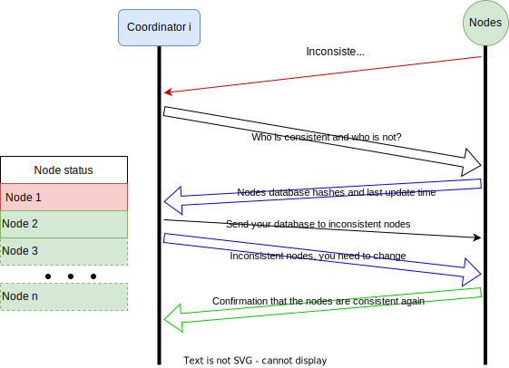
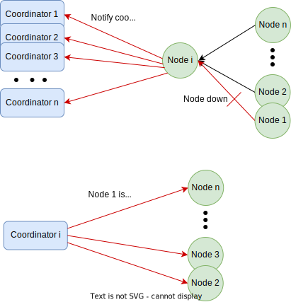
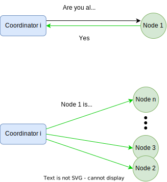
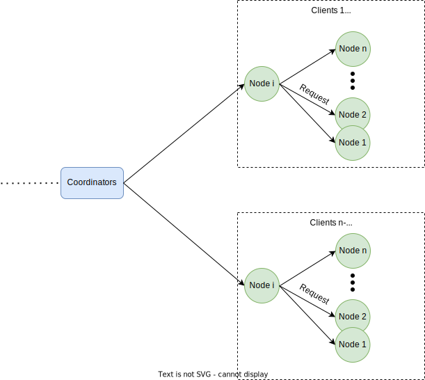

# Web-scale Data Management Project

This project implements a set of microservices for a shopping cart.

### Technologies used
* `python`
* `Flask`
* `mongoDB`
* `docker`
* `docker-compose`
* `nginix`
* `kubernetes`
* `ssh`

### Project structure

* `balancer`
    Folder containing `nginix` configuration for load balancing between the coordinators

* `build_compose`
    Folder containing configuration for the docker-compose deployment
    
* `common` 
    Folder containing common files shared between services and coordinators

* `coordinator`
    Implementation of the coordinators

* `env`
    Folder containing the Redis env variables for the docker-compose deployment

* `k8s`
    Folder containing the kubernetes deployments, apps and services for the ingress, order, payment and stock services.

* `order`
    Folder containing the order application logic and dockerfile. 
    
* `payment`
    Folder containing the payment application logic and dockerfile. 

* `stock`
    Folder containing the stock application logic and dockerfile. 

* `test`
    Folder containing some basic correctness tests for the entire system.

### Deployment types:

#### docker-compose (local development)

In order to create a docker-compose file it is needed to run `python3 build_compose/builder.py`. The number of nodes for each service is defined in the file env/addresses.env. This file contains the first part of the IP addresses that we will use as "PREFIX_IP" and the last 1-3 digits that will be used for the nodes/coordinators of each service (separated by semicoloms).

After creating the docker-compose.yml file in the main folder you can run `docker-compose up --build` to start the whole shopping cart service.

***Requirements:*** You need to have docker and docker-compose installed on your machine.

#### minikube (local k8s cluster)

This setup is for local k8s testing to see if your k8s config works before deploying to the cloud. 
First copy the docker images (in case of being a developer) with `bash docker-push-images.sh`, then make the scripts to deployment for kubernetes using `bash deploy-charts-minikube.sh`. 

The scripts will be at the k8s folder, you can go inside and run `kubectl apply -f .` in order to start your cluster. 

Once the cluster is running you may forward the port of the nginx service to a port of your local machine with `kubectl port-forward service/balancer 5000:80` in order to be able to query the service.

***Requirements:*** You need to have minikube (with ingress enabled) and kompose installed on your machine.

#### kubernetes cluster (managed k8s cluster in the cloud)

We believe that following the steps of the minikube deployment this one can be done in a similar fashion. As we were only 3 group members we did not have time to do an actual deployment in a google cloud server.

***Requirements:*** You need to have access to kubectl of a k8s cluster.

### Evaluation:

#### Scalability 

The system design, as seen in the figure below, allows us to add as many nodes as we want. Each set of nodes will have a coordinator and the load between the coordinators and the nodes is equally distributed.

#### Consistency 

To ensure consistency we hash every database. The hashes of the multiple instances of a database are compared. If at least one of them is different from the others, then there is an inconsistency. To restore from the inconsistencies, we find the most common hash and we assume that the databases with the most common hash are consistent, so the rest have to be restored. If there is not a common hash in between the databases, then we check which database was last updated and we assume that this is the consistent one. Once we have a list of the inconsistent and inconsistent databases, we choose a consistent database to dump their data. Then, this data is used to update the inconsistent ones.

#### Availability 

For each service there are multiple coordinators and nodes. The load between the coordinators is balanced by a load balancer. For this purpose we use `nginix`. Hence, a request is first directed to the load balancer, which decides to which coordinator it is going to be sent. The coordinator hashes the request and forwards it to one of the nodes. If the request is a write, this node also forwards the request to the rest of the nodes. If the request is a read, nothing else is needed to be done. Moreover, the different services communicate with each other via their coordinators. In the figure below we see that if service `i` i.e. order service needs to communicate with another service i.e. payment service, it first informs its coordinator (i.e. coordinator service 1), which then communicates with the coordinator of the payment service (i.e. coordinator service 2).

#### Fault Tolerance 

Suppose node A is forwarding a request to the rest of the nodes. Suppose also that one of these nodes is down, let's say node B.
In that case, the request that is sent by node A to node B returns a time-out and, hence, node A is aware of the node B being down. Then, node A informs the coordinator that node B is down and the coordinator removes node B from the list of nodes. IN this way, we reassure that the response time remains short and we avoid reduced availability of the service. The coordinator checks regularly if  node B is up again. Once it is up it informs all the other nodes.

#### Transaction Performance

The computer used for these experiments has the following specs:

- CPU unit: Intel® Core™ i7-7500U CPU @ 2.70GHz × 4 
- Memory: 23.4 GB of RAM, 2 of swap memory.
- No GPU.

The results here are for a configuration using 3 nodes and 2 coordinators per service. All the tests were run querying a minikube cluster with one container per node/coordinator:

100 users
- No failures.
- Average response time 2737 ms.

1000 users
- 25% of the request fail.
- Average response time 12193 ms.

For the consistency we got the following results:

Stock service inconsistencies in the logs: -100
Stock service inconsistencies in the database: -100
Payment service inconsistencies in the logs: 100
Payment service inconsistencies in the database: 900.0

These results are bad and are caused by the propagation of the write operations to the different nodes and the fact that the computer used for these experiments had very limited resources. 

As we observe that the system works well for 100 users, we think that using this system but with the creation of batches of nodes per 100 clients would result in a more efficient and stable system. Due to time and resource constrains we were not able to implement such system, but it would look like the one described in the following image:

#### Event-Driven Design

The requests from a node to the rest of the nodes are done concurrently, and the node has to wait for their reply to return an answer to the coordinator.